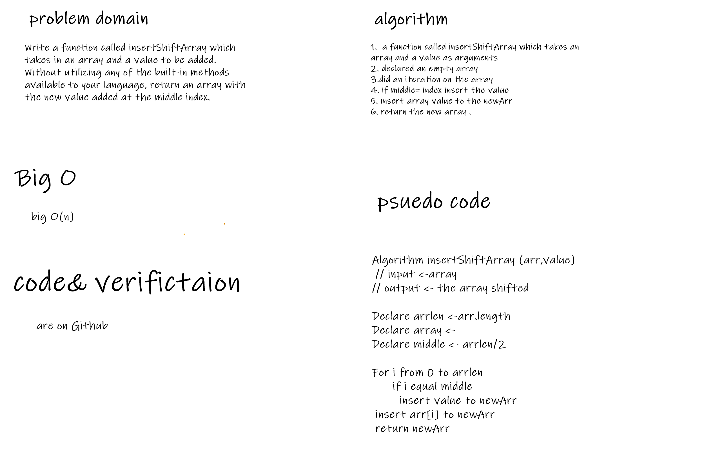

# Insert to Middle of an Array
<!-- Description of the challenge -->
putting a value into the middle of an array

## Whiteboard Process
<!-- Embedded whiteboard image -->

## Approach & Efficiency
<!-- What approach did you take? Discuss Why. What is the Big O space/time for this approach? -->
big O(n)