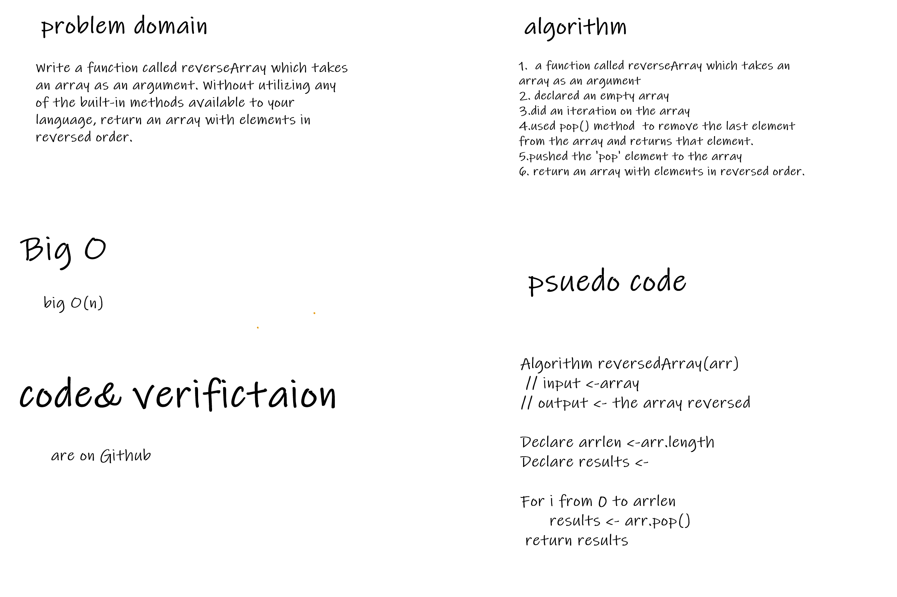

# Reverse an Array

<!-- Description of the challenge -->

Wrotee a function called reverseArray which took an array as an argument. Without utilizing any of the built-in methods available to your language, returned an array with elements in reversed order.

## Whiteboard Process

<!-- Embedded whiteboard image -->

## Approach & Efficiency

<!-- What approach did you take? Discuss Why. What is the Big O space/time for this approach? -->

big O(n)
